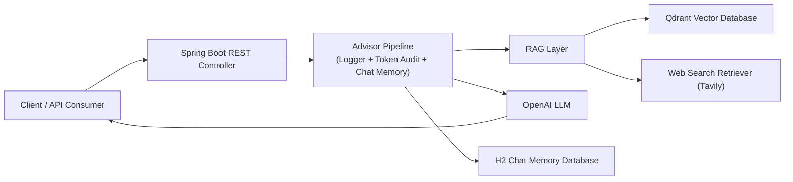

# Farm AI Assist
> AI-enabled backend system built with **Spring Boot + Spring AI** using **RAG, vector search, and web retrieval**.
Farm AI Assist is a **Spring Boot + Spring AI** project demonstrating how to build an **AI-powered intelligent backend system** using **Retrieval-Augmented Generation (RAG)**, vector databases and web search.

---

## Features

* OpenAI API integration via Spring AI
* Retrieval-Augmented Generation (RAG)
* Vector search using Qdrant
* Web-search augmentation using Tavily
* Prompt templates and context injection
* Streaming LLM responses
* Structured AI outputs (JSON / POJO mapping)
* Chat memory using JDBC repository
* Automatic vector database startup via Spring Boot Docker Compose

---

## Architecture
The system follows a **Retrieval-Augmented Generation (RAG)** pipeline where user queries are enriched with contextual data from both a vector database and external web search before being sent to the LLM.



---

## Tech Stack

### Backend
- Java
- Spring Boot
- Spring AI

### AI
- OpenAI API
- Retrieval-Augmented Generation (RAG)
- Prompt Engineering

### Data
- Qdrant (Vector Database)
- H2 Database (Chat Memory)

### Infrastructure
- Docker
- Spring Boot Docker Compose

---

## API Endpoints

### Chat with LLM

```
GET /api/chat?message=Your question
```

### Chat with LLM (Streaming Output)

```
GET /api/stream?message=Your question
```

### Chat with Memory

```
GET /api/chat-memory?message=Your question
```

### Random Chat with Vector (RAG)

```
GET /api/random-chat?message=Your question
```

### Chat with Vector Documents (RAG)

```
GET /api/document-chat?message=Your question
```

### Chat with Web Search

```
GET /api/web-search-chat?message=Your question
```

---

## Configuration

Example `application.yml` configuration:

```yaml
spring:
  ai:
    openai:
      api-key: ${OPENAI_API_KEY}

    vectorstore:
      qdrant:
        host: localhost
        port: 6334
        collection-name: navneet
        initialize-schema: true
```

---

### Requirements

* Java 21+
* Docker
* OpenAI API Key
* Tavily API Key

### Environment Variables

```
export OPENAI_API_KEY=your_openai_key
export TAVILY_SEARCH_API_KEY=your_tavily_key
```

When the application starts:

* Spring Boot automatically starts the **Qdrant container**
* The vector collection is created if missing

---

## Why This Project

Many AI demos only show direct LLM API calls.  
This project demonstrates how to build **production-style AI backend architecture** with:

- Retrieval pipelines
- Vector databases
- Web retrieval
- Conversation memory
- Structured outputs

---

## Purpose

This project demonstrates how to build **modern AI-enabled backend systems** using:

* Spring AI
* Vector databases
* Retrieval-Augmented Generation
* Streaming LLM responses
* Structured AI outputs

---

## Author

Navneet ( Java Backend Developer | Spring Boot | AI Integration )
